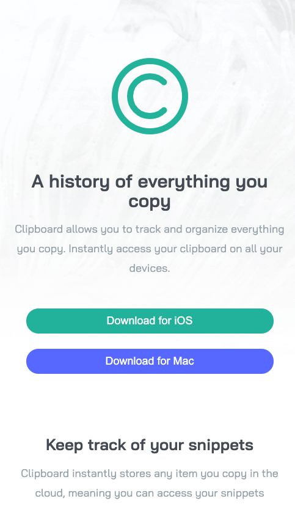

# Frontend Mentor - 3-column preview card component

This is a solution to the [3-column preview card component challenge on Frontend Mentor](https://www.frontendmentor.io/challenges/clipboard-landing-page-5cc9bccd6c4c91111378ecb9). 

## Overview

### The challenge

Users should be able to:

- View the optimal layout depending on their device's screen size

### Screenshot

- Desktop View

- Mobile View

### Design

- 

### Links

- Solution URL: (https://github.com/Dean-Jeffery/FrontendMentor-ClipboardLandingPage)
- Live Site URL: (https://dean-jeffery.github.io/FrontendMentor-ClipboardLandingPage/)

### Built with
- HTML & CSS
